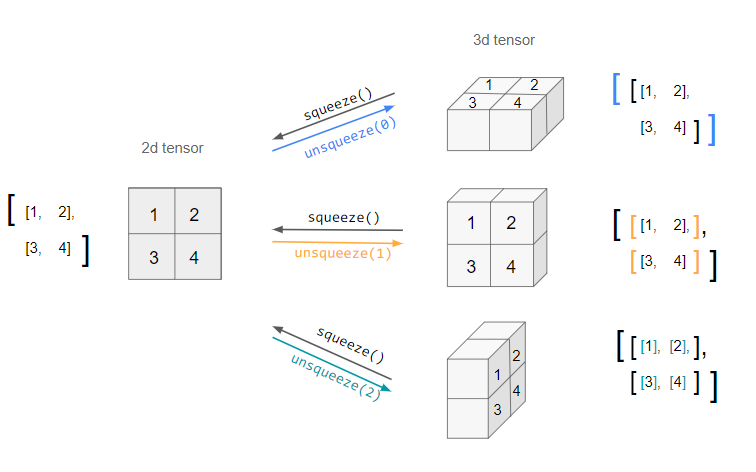
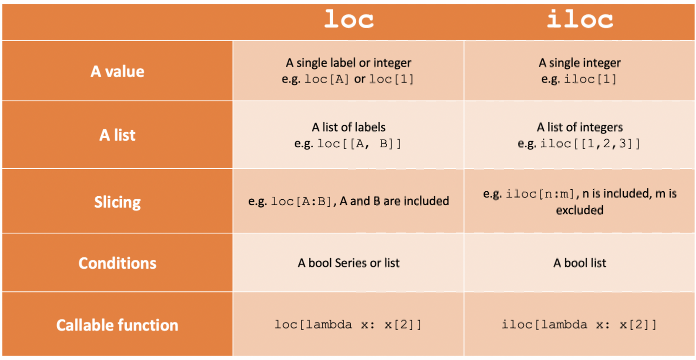
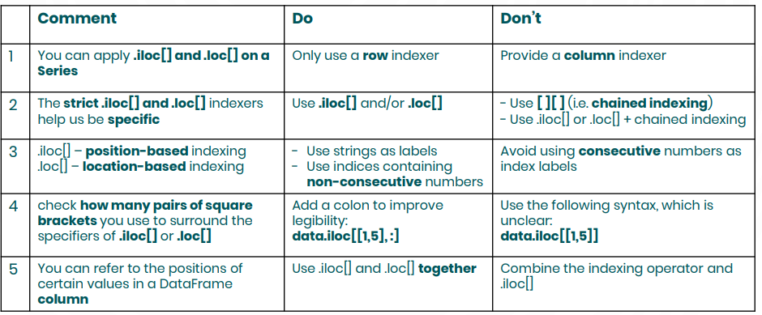
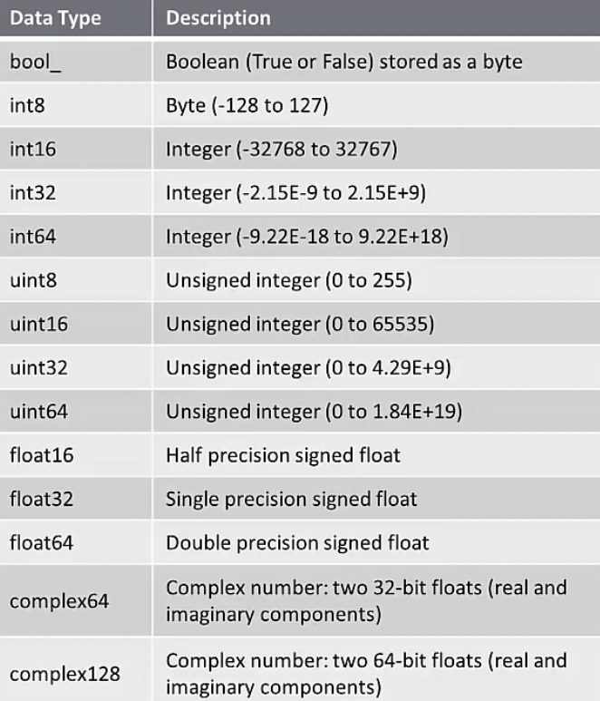
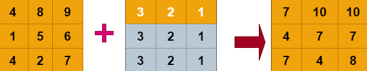

## Data Analyst Lesson

### NumPy
NumPy gives you an enormous range of fast and efficient ways of creating arrays and manipulating numerical data inside them
[Documentation](https://numpy.org/devdocs/user/absolute_beginners.html)

- To create a variable array we do:
    ```py
        array = np.array([4,5,6,7,10])
    ```
- To create a 2x2 array we do:
```py
    array = np.array([[4,5],[7,10]])
```
- To get the mean value of the array we do:
```py
    np.mean(array)
```
- To find the axis mean for all the rows of array:
```py
    np.mean(array, axis = 1)
```
- To find the axis mean for the columns of array:
```py
    np.mean(array, axis = 0)
```
### Pandas Library
- Series is a one dimensional array holding data of any type
```py
    series.dtype # this shows the type of the array series
    series.size #shows the amount of elements in the object
```
- Type 'O' means its a non numeric type
- We can assign a name to an object so we can reference it later on
```py
    product_categories.name = "Product Categories"
    #now when we print it will show the new name
    print(product_categories.name)
```
- The attributes related to a certain python object allow us to extract information about it but arent meant to alter or modify its content
- Series have index values that point to the integer values
- Series should be treated as its own index and if we call it it will show it as its own indexes
```py
    prices_per_category.index
```
## Label Based vs Position Based Indexing
- The numbers on the left refer to the posiotion within the order sequence on the right which means that it will be a rangeIndex which is Position Indexing

- This is also known as a Zero based index
- To not get confused people look at the index position instead of the actual position of a variable
- To know if we are working with a range indesx object we can check its type by doing
```py
    type(series_a.index)
    #to show what index it has we do
    list(series_a.index)
```
- Label based index is where you label your index based on what it is instead of a numeric position
- Basically there are two types of Indexing: Explicit and Implicit
- Explicit indexing:
    - Explicit are created explicitly and have the use of the index in queries which are the same
    - Explicit indexing also means that we set the dictionary to a variable
    Ex:
    ```py
        prices_per_category = pd.series({'Product A': 22250,'Product B': 22250, 'Product C': 22250})
    ```
- Implicit indexing:
    - Used to refer to indexes that are created by operations other than 'create index'. It usually occurs when using primary keys or using unique constants
- If an index is not defined then a zero based index will be set
- Implicit is used with the first example concerning the index positions instead of a label and explicit is shown in the second example with the dictionaries name instead of a position name
- To set an index number instead of the default 0 we can do:
```py
    series_b = pd.series([10,20,30,40,50], index = [1,2,3,4,5])
    #in the above it will set the index numbers starting from 1 and going up to 5 for each other series which means it treats it as an index label
```
- When we use strings though we can do zero indexing and it wont return an error likr the second to previous would
### Using Methods and functions
- .idxmax() is used when we return the index label of the highest value, respectuively to the .idxmin()
- Some methods in pandas that are often used are: .sum() .min() .max() .idmin() .idmax()
- Using .head() shows the first 5 datasets while .tail() returns the last 5 rows of the dataset
### Parameters vs Arguments
- We can also determine how many tails and heads we want returned by adding a number in the parameter
[Documentation for head Panda](https://pandas.pydata.org/docs/reference/api/pandas.DataFrame.head.html)
### Data Frames
- A series is a single column data and corresponds to a single value, it is also a one dimensional data structure
- A dataframe is a multiple column data where each column has different variables, this basically can be seen as multiple series in a dataframe
    - It is a two dimentional data structure
    - it also is seen as a data sheet/ spread sheet
- Difference between reading and parsing a text file
    - reading transfers text to the computers memory while parsing means that we have to understand the purpose of the object
    - For example: someone copying an image, the machine copying is reading an image but if someone goes up and looks at the image being copied and connects what it has like the people and background then that is parsing
- 3 type of data structures
    - Structued
        - uses relational DB
        - Organized in a tabular form
        - can be stored in a database
        - Easy and quick access to a specific value
        - ex: spread sheets, SQL db, pandas dataframe
    - Semi-structured
        - uses other patterns to store and organize data for easier access and analysis
    - Unstructured
        - Opposite of structured
        - information organized in a way that is hard to find things
- Big data: referes to extreme large data sets that been allocated on multiple computers
    - some things that also define it as big data can also be: velocity, volume, variety, etc
    - Structured, semistructured and unstructured data are also categortized as big data

- Data connectivity through text files
    - test files == flat files == ascii files
    - rich test files have bold and other formatting, for example docs
    - flat files has a separator where it makes it easy to read for machines and uses traditional data structure
    - csv are flat files
    - Delimeters are not separators and instead define fields like cells in a row or rows in a table and can be a space separator as well
    - There is also a Tab-Separated value where its used in practice to format the data
    - Flat file refers to a single table in the database (single relational db composed of a single data table)
    - Fixed - width data file: Uses a flat file where a delimeter has been included to make identical or to fix the fields which the data values have been stored but not used anymore since they caused problems in data preprocessing

```py
    filename = "source.txt" # we are setting the string name as source.txt

    file = open(filename, mode = 'r') # this means we will open the file we designated as a string and return as a file object and with the mode parameter we can set how we want to look at the file and set the mode of how we want to open the file. the default will be read text

    # print(file) # it will return a wrapper but to read the actual file we will have to add the read option

    #print(file.read()) # the thing with this though is that if its rerun multiple times only on this line it wont work since its only able to return once and the rest returns an empty string
    #in this case we have to store the string created to a new variable

    text = file.read()
    print(text)

    # after opening a file we need to close it or else it will keep a connection between the python code and file directories of our computer and itll be live
    file.close()
    print(file.closed) # tells us if the file is closed true = closed, false = open
```
- using the with statement along with open is more efficient
```py
    filename = 'source.txt' # setting the string as source.txt
    with open(filename, mode = 'r') as out_file: #out_file is just wat we named it and then after is when we read it to let us return what it has in the txt file
            print(out_file.read())
    # the good thing about this is when we finish reading this block of code, it automatically closes it and we dont need to close it ourselves

    # we can also write on the file if we want to
    with open(filename, mode = 'w') as out_file:
            out_file.write("adding string from code")

    with open(filename, mode = 'r') as out_file:
            new_text = out_file.read()
    print(new_text) #this prints our new write bc we cant do it in previous write code since it only writes and not reads
```
- Importing CSV files with pandas
[helpful link](https://pandas.pydata.org/docs/user_guide/10min.html)

```py
    #we can use pandas to import the text file instead of dointg a block of code if we were to open a large csv file it will bombard with a lot of information and we wouldnt know where it begins or ends but iwth pandas we can import something to organize the output of our csv file

    import pandas as pd

    #readThis = 'Lending-company-single-column-data.csv'
    #this way it will show you the table cut and short but if we do below it will show the whole table
    print(pd.read_csv('Lending-company-single-column-data.csv').to_string()) #this created a dataframe for us, it gets the value of the objects
```
```py
import pandas as pd

print(pd.read_csv('Lending-company-single-column-data.csv', header = 0))
#Row number(s) to use as the column names, and the start of the data. 
```
- To redefine a column index name we can use index_col() where we set what the new index column name will be since its already attached
    - For example:
```py
    # we originally have this output 
    import pandas as pd

    filename = 'Lending-Company.csv'
    my_csv_data = pd.read_csv(filename)
    print(my_csv_data)
    #but if we want to redefine the index to prevent confusion based on how many indexes there actually are we do:
    newfilename = 'Lending-Company.csv'
    my_newcsv_data = pd.read_csv(newfilename, index_col = 'LoanID') #this will redefine our index to the column we are defining it instead of default index
    print(my_newcsv_data)
```
- if we want to create a new table we can do
```py
    data = {'ProductName': ['Product A', 'Product B', 'Product C'], 'ProductPrice':[22250, 16600, 12500]} # creating a new table
    product_ID = ['A', 'B', 'C'] # creating new IDs
    df = pd.DataFrame(data, index = product_ID) #creates a tabular data for the information provided
```
- np.loadtxt() vs np.genfromtxt()
    - load means that the data is ready to be imported and used
    - faster
    - breaks when we give it incomplete or incorrectly formatted sets
    - genfromtxt is short from generated from text where it creates the dataset from the text file
    - so it will generate the array as we read the text file so it only takes the rows and columns and splits into multiple variables
    - more flexibility and can handle missing values
    - delimiters are things used to define distinct fields in text files for example when we use commas
```py
    lending_company_numeric = np.loadtxt('Lending-Company-Numeric-Data.csv', delimiter = ',')
    lending_company_numeric
#the delimiter is showing that the values are separated by the comma but if it was different we would edit it
    lending_company_numeric2 = np.genfromtxt('Lending-Company-Numeric-Data.csv', delimiter = ',')
    lending_company_numeric2

    #to check if two arrays are equal we do np.array_equal(string, string)
    np.array_equal(lending_company_numeric, lending_company_numeric2)

    # working with missing variables using both ways showsn before
    lending_company_numeric_NAN = np.loadtxt('Lending-Company-Numeric-Data-NAN.csv', delimiter = ';')
    lending_company_numeric_NAN
    # returns an error because it encountered a symbol rather than a number

    # working with missing variables using both ways showsn before
    lending_company_numeric_NAN2 = np.genfromtxt('Lending-Company-Numeric-Data-NAN.csv', delimiter = ';')
    lending_company_numeric_NAN2
    # successfuly runs

    # another way to fix this is to tell the code to read everything as a symbol rather than numbers
    # working with missing variables using both ways showsn before
    lending_company_numeric_NAN3 = np.loadtxt('Lending-Company-Numeric-Data-NAN.csv', delimiter = ';', dtype = str)
    lending_company_numeric_NAN3

```

- Partial Cleaning while Importing
```py
    lending_company_numeric_NAN4 = np.genfromtxt('Lending-Company-Numeric-Data-NAN.csv', delimiter = ';', skip_header=2)
    lending_company_numeric_NAN4
    # skip header will remove first two lines of the dataset, we can omit as many lines as we want from the top of the dataset

    lending_company_numeric_NAN4 = np.genfromtxt('Lending-Company-Numeric-Data-NAN.csv', delimiter = ';', skip_footer=2)
    lending_company_numeric_NAN4
    # skip header will remove last two lines of the dataset, we can omit as many lines as we want from the bottom of the dataset

    lending_company_numeric_NAN4 = np.genfromtxt('Lending-Company-Numeric-Data-NAN.csv', delimiter = ';', usecols=(2, 5))
    lending_company_numeric_NAN4
    # usecols means we only want to look at the specified column
    # we dont have to specify the order we want the output and if we want we can combine what we previously did as well

    # if we want to separate a column to a variable name we can do as below
    lending_co_data2, lending_co_data5 = np.genfromtxt('Lending-Company-Numeric-Data-NAN.csv', delimiter = ';', usecols=(2, 5),skip_header = 2,skip_footer=2,unpack=True)
    #unpack is used to work with different variables and print out the different strings we have
    #Unpacking in Python refers to an operation that consists of assigning an iterable of values to a tuple (or list ) of variables in a single assignment statement

    print(lending_co_data2)
    print(lending_co_data5)
```
- to import json files we can do:
```py
    import json

    parsed_str = json.loads(prices_per_product) # w json loands we can read JSON data from text, JSON, or binary file and turns it into an object, it parses through the string and returns a dictionary
    print(parsed_str)

    import pandas as pd

    pd.read_json('Lending-company.json')
    new_csv_data = pd.read_json('Lending-company.json')
    new_csv_data
    

```
- we can read an excel file by doing read_excel instead of read_csv etc
- if we ever want to just look at specific sections of a table we can use read_csv to return to us only the ones we want and we assign the new index to it. From there we set it to a new variable so that we dont ruin any original data:
```py
location_data = pd.read_csv('Lending-company.csv', usecols = ['StringID', 'Location', 'Region'], index_cols = 'StringID')
print(location_data.head()) # head returns the 5 first rows of the dataframe
```
- to organize your data and separate it better to view we can do below:
```py
import pandas as pd

filename = 'Lending-company-single-column-data.csv'
my_data = pd.read_csv(filename, delimiter = '\,', engine = 'python')
#using the slash separates it by column and makes it easier to read but instead of delimiter we can use sep as well
#also since py is built upon c we will need to tell the engine type of python
print(my_data.head())
```
- squeeze parameter is used when we want to remove single-dimensional entries from the shape of an array, in addition it squeezes 1 dimensional axis objects into scalars

```py
df_cols = pd.read_csv('Lending-company.csv', usecols = ['Product'])
print(df_cols.head())

df_single_col = pd.read_csv('Customer-Gender.csv')
print(df_single_col)

df_single_col = pd.read_csv('Lending-company.csv', usecols = ['Product'], squeeze = True)
print(df_single_col)
# if we want to get a response as a series object we have to use squeeze parameter. If the data has only one column itll then return a series. squueze will try to reduce the dimension if its possible to reduce

#since the new 2.0 update on python, using the regualr way of squeeze as shown above will no longer be supported so as shown below is how itll be moving to new updates
import pandas as pd
import numpy as np

df_single_col = pd.read_csv('Customer-Gender.csv')
np.squeeze(df_single_col)
print(df_single_col)

```
- To export our data from a python object to a text file we can do as below:
```py
my_data.to_csv('my-csv-file.csv')
my_data.to_json('my-csv-file.csv')
my_data.to_excel('my-csv-file.csv') #this will export the file with an indexing attached but if we dont want automatic indexing we can do as below
my_data.to_excel('my-csv-file.csv', index= false)
```
- to save a file in numpy we use the save option
```py
import numpy as np

lending_co = np.genfromtxt('Lending-Company-Saving.csv', delimiter = ',', dtype = np.str)

print(np.save('Lending-Company-Saving', lending_co))#new file we are creating. the format we do when saving to a new numpy file is np.save('file-name', dataset_variable)
```
- nmpy files might be chosen since they can run faster and can package more data in it
- importing a dataset isnt the same as loading a dataset because importing doesnt keep track of the datatype of the original array so we need to specify the datatype of the values after bringing them in py. But when loading we dont need to specify or change the data while working w py object
- the most convenient feature of numpy is that the entire dataset keeps its format so this means we dont need to reorganize
- to load the numpy file into python we do:
```py
lending_data_save = np.load('Lending-Company-Saving.npy')
```
- theres another form of saving a npy file, and this way is more compact and we can add multiple datasets and call specific ones without wasting time and space on multiple files
```py
import pandas as pd
import numpy as np

lending_co = np.genfromtxt('Lending-Company-Saving.csv', delimiter = ',', dtype = str)

lending_data_save = np.load('Lending-Company-Saving.npy')

print(np.savez('Lending-Company-Saving', lending_co, lending_data_save)) #savez creates an npz file instead of an npy. NPZ is like an archive for NPYs that can store multiple arrays so instead of storing different datasets in separate npy files we can store all of them in a single NPZ. this makes it helpful when working with large amounts of data

lending_data_savez = np.load('Lending-Company-Saving.npz')

print(lending_data_savez["arr_1"])#this will print out our array but we cant open all of them together so we have to specify which one we want to open

np.savez("Lending-Company-Saving", company = lending_co, data_save = lending_data_save) #this adds files into the npz file

lending_data_savez = np.load("Lending-Company-Saving.npz") #loads the python file that we have so that we can save and load objects within it

print(lending_data_savez.files) #this checks what files are inside our npz file, with this we are able to remove the need to use arr_0 or arr_1 when looking for a file to print and instead we can use its name

print(lending_data_savez["company"]) #now we can use the actual names rather than array
```
- We will save data into text files
- this helps store numpy datasets in txt files
```py
import pandas as pd
import numpy as np

lending_co = np.genfromtxt('Lending-Company-Saving.csv', delimiter = ',', dtype = str)

np.savetxt('Lending-Company-Saving.txt', lending_co, fmt = '%s', delimiter = ',') #for the first section we have to set what the name of the file we want it to be when saves, for the second what file we are referencing to save to a text file and the format (fmt) to let it know what it consists of and in this case its string so we do %s then the delimiter

lending_data_savetxt = np.genfromtxt('Lending-Company-Saving.csv', delimiter = ',', dtype = str) #np txt requires us to import the file once again so we do this line
print(lending_data_savetxt)
```
- working with text data and argument specifiers
- text files consists of information from the text data rtytpe only like .json, .csv, .html but text data has information or data that that represents text as opposed to numbers or boolean 
- working with arguments we have to use % and then a letter based on what type of variable we are working with 
```py
product_category = 'A'
# different ways of printing arguments in python
print('This item is from product category "%s".' % product_category)
print('This item is from product category',  product_category, ".")

# if any case we have an array and we want to print a position we do
product_category1 = ['A', 'B']
print('This item is from product category %s.' % product_category1[1])
#if we want to insert an integer we do %d
#when using floar identifiers $%f it will by defauly give us six digits after the decimal point but we can restrict it by adding a number like $%.2f but if we do a whole number we do $%.f and if we want to round up we can do .1 instead
# we can also set an index of i and refernce the index when outputting
```
- manipulating python string
- we need to manipulate when import, export, and organizing information from text files
- if we want to add a tab space between something we do `\t` before we end the string of a sentence
- when working with text file names we will usually use `\r` where its a carriage return. in other words it means it moves the cursor to the beginning of the line and then keeps outputting characters as normal and will replace the amount after the \r to the amount in the beginning, more or less
```py
print('This product is from Category "A". \rProduct 01')
#output: 'Product 01ct is from Category "A".'
```
- there are different ways to edit a string and some include:
```py
s = 'Price per unit'
s1 = s.replace('Price', 'Cost') #will replace price as cost 
# starts with and ends with are used to check if a certain string starts or ends with a certain string and itll return a boolean response
s1.startswith('Cost') 
s1.startswith('cost')
s1.startswith('Price')

s1.endswith('nit')
s1.endswith('nits')

s1.split() # this will split all of the string words
#if we want to know how many indexes a string has we do len()
s1.split(' ')
s1.split(" ") # the spaces mean that we want to separate the string based on the space between them
s1.split('') # this will return an error
s1.split('per') # this will split by every per it sees

s1.split(' ', maxsplit = 0) # maxsplits specifies the max number of splits we can obtain with its execution, we can also give it a maxsplit by setting it as
s1.split(' ', 0) #instead of having the variable maxsplit = 
s1 = 'Mr., John, Wilson'
s1.split(',') #will split for every ',' it sees
s1.split(',')[0] #it will return the index position of the string we have so in this case since we have array index of 0 itll return the first value being Mr

s3 = 'Mrs. Amy Moore'
s3.upper()
s3,lower()

s3.capitalize() #capitalizes the first string
s3.title() #capitalizes the beginnning of every string piece

'Cost per unit.'.title() # we can use a string instead of a variable when using these formats

s4 = '   quarterly earnings report   '
s4.strip() # automaticall remove the extra spaces from the string
s4.strip(' ') #will do the same as above
s4.strip(' r') #removes any characters specified between the quotes in both ends of given string and removes the characters until encounters a different character
s4.strip(' qt') #removes the q and t from the beginning and end of the string
s4.strip('qt')

#if we dont want to remove the beginning and end of a string when stripping we can do lstrip or rstrip as well

s4.lstrip() #removes white space from the beginning
s4.rstrip() #removes white space from the end

s4.lstrip(' quarterly')
s4.strip(' quarterly') #if we do something like this to remove a string it will remove part of the other strings because its being used incorrectly, so instead we can set it to a new variable and retry as shown below. the reson why is because the white spaces messes it up so in order to fix it we set it to a new variable with no extra white strings and then retry it and it should work
s5 = s4.strip()
s5.strip('quarterly')

#if we encounter a string where we dont know where the variables that we want to remove are, we can just add it all to the split and itll remove whatever it finds that matches the strip
s6 = ' %&!quartely earnings report  *'
news6 = s6.strip(' !@#$%^&*()')
print(news6)
```
- string accessors
- working text data by manipulating string values in a series object
- A pandas Series is a one-dimensional labelled data structure which can hold data such as strings, integers and even other Python objects
```py
import pandas as pd

operational_kpis = pd.Series(["employee satisfication rating", "employee churn rate"])
print(operational_kpis) #series in pandas creates the row and columns for the data we set it to
#if we want to strip one of two string that we have we have to let it know which index its located and from where to remove it from:
operational_kpis[0].lstrip('employee') #this will remove employee from first index string
operational_kpis[1].lstrip('employee')#this will remove employee from second index string

#if we want to remove the same string name to all index strings we can use string accessors
print(operational_kpis.str.lstrip('employee'))
#output:
# 0     satisfication rating
# 1               churn rate
# dtype: object

#if we set a series with a number and a string instead of only a string and try using the str. function then itll return NaN because its not a string and we are treating it like a string but it has an integer but it will remove it from the string it was able to find and strip

#whewn using the contain method we use it if we want to check and see if the values include what we are looking for and itll return a boolean response
house_prices = pd.Series(['$400,000', '$500,000','$600,000'])
print(house_prices.str.contains("$"))
```
- .format() is a good tool to use when preprocessing data
```py
time_horizon = 1, 3, 12

print(time_horizon)

products = ['Product A', 'Product B']
#format() will have formatted values as txt first regardless of their initial data type
print('Expected sales for a period of {} months(s) for {}'.format(time_horizon[0], products[1]))
print('Expected sales for a period of {1} months(s) for {1}'.format(time_horizon[0], products[1]))
#format are placeholders where we insert the values that have been passed as arguments of the .format() method
print('Expected sales for a period of {time_hor} months(s) for {prod}'.format(time_hor = 12, prod = 'Product C'))

print('Expected sales for a period of {time_horizon[1]} months(s) for {products[1]}'.format(time_horizon, products))
```
- Iterating over ranged objects
- Sequences consists of tuples and lists
```py

t = [4, 5, 6, 7]
for i in t:
    print(i, end = ' ') #this is an enhanced for loop and it will automatically increase the i by one every time it runs and we need the end = ' ' to show that we want it to read until the end of the array
    #when using range we can set it when we want it to start and end when ranging
for i in range(5):
    print(i, end = ' ')
```
- nested loops 
```py
for i in range(2): #these are are rows
    for j in range(5): #and these are our columns
        #when nesting this will print as many times as the above loop tells it to
        print([i,j])

for i in ['Product A', 'Product B']: #we can also work with strings when iterating
    for j in range(5):
        print([i,j])

products = ['Product A', 'Product B']
exp_sales = [10000, 11000, 12000, 13000, 14000]

for i in products: #we can also work with strings when iterating
    for j in exp_sales:
        print([i,j])
```
- triple nested for loops
```py
products = ['Product A', 'Product B']
exp_sales = [10000, 11000, 12000, 13000, 14000]
time_horizon = (1, 3, 12)

for i in products: #we can also work with strings when iterating
    for j in exp_sales:
        for k in time_horizon:
            print([i,j*k])
```
- if we use triple nested loops we can also use the arguments to print us an output
```py
products = ['Product A', 'Product B']
exp_sales = [10000, 11000, 12000, 13000, 14000]
time_horizon = (1, 3, 12)

for i in products: #we can also work with strings when iterating
    for j in exp_sales:
        for k in time_horizon:
            print('Expected sales for a period of {} months for {} : ${sales}'.format(k, i, j, sales = j * k))
```
- list comprehensions
- this is a way where we can cut the size of coding for smaller and more efficient pieces of code
```py
#first example
numbers = [1, 13, 4, 5, 63, 100]

new_numbers = [] #initialize a new empty array

for n in numbers:
    new_numbers.append(n*2) #we will be running through our array and multiplying by two then adding it to the new array that we have

#this will be a type of list
print(new_numbers)

#shortvcut to using for loops for an array
new_numbers2 = [n*2 for n in numbers]
print(new_numbers2)

#second example
for i in range(2):
    for j in range(5):
        print(i+j, end= ' ')

#instead of the previous we can cut it all to this small piece of code

outcome = [i+j for i in range(2) for j in range(5)]
print(outcome)

#if we want to add different array pairs when oiutputting instead of a long array we can do as below
#this will return to be a type list

outcome1 = [[i+j for i in range(2)] for j in range(5)]
print(outcome1)

print(list(range(1,11))) #this will print out a string starting from 1 and ending at 10

#deliver a list containing integers equal to the values of the generated sequence raised to the power of 3 on the condition that the base values are odd numbers

[num **3 for num in range(1,11) if num % 2 !=0]
#if we want to do if statement in the beginning we cant leave it alone and it must include an else statement
[num **3 if num % 2 !=0 else 'even' for num in range(1,11)]
```
- lambda functions to create anonymous (lambda) functions
- to handle a function that only does one thing and its focus on the function itself we should use anonymous functions
- a lambda function is equivalent to a normal function
- lambda functions can also have multiple parameters so we can have x and y
- lambda functions contain only a single expression and can only be applied to a larger expression they are written
```py
from tkinter import Y


def raise_to_the_power_of_2(x): #created a method called raised to the power of 2 and takes an x argument which means that we have to return an x argument since its in the function call (method == function)
    return x ** 2
print(raise_to_the_power_of_2(3)) #in order to get the actual output of a method we need to call the method once again in the 'main' function and add the argument data for the x to handle

#to use a lambda function we do:
raise_to_the_power_of_2_lambda = lambda x:x ** 2

print(raise_to_the_power_of_2_lambda(3))

#we can also add the input instead of calling it again after as shwon below:
print((lambda x:x/2)(11)) #the 11 is the input we have which will be our x

#lambda can use multiple functions
sum_xy = lambda x, y:x+y 
print(sum_xy(2,3))

#when we use lambdas we cant have a f(x) format as below so we have to reference another lambda function for it to work
sum1_xy = lambda x, y:x+y(x)
print(sum1_xy(2, lambda x:x*5)) #for y(x) instead of having a number for y we set a new lambda function where it already calculates it and sets it as the 'y' side and itll be able to calculate it

```
- what is data gathering/data collection
- primary data is data that we have created 
- obtaining primary data isnt usually approached so instead secondary data is used since its most common to have access to
- to get information online that isnt in a file we can do web scraping or use APIs
- web scraping extracts information from a website
    - with this technique you need to use specific structure and if its not used correctly it can break existing scrapers
    - its not easy to scale
    - a lot of web scraping isnt allowed since the requests can over populate the website and cause it to crash since its only intended for humans to use it not bots
- APIs are the bridges of the digital world where it can design specifically for programmatical data exchange and the workflow are streamlined and easy to use
- APIs need to be maintained 24/7 by the creator

### APIs
- specifies how softweare components should interact
- https specifies how requests and responses are to be formatted and transmitted
- http requests are more popular in get and post requests
- post are used to modify information and parameters are added in the body
- response requests returns a status code:
    - 200 means it was successfully
    - 404 means theres an error

- Data exchange format for API: JSON
- build upon lists and dictionaries
- to check the keys we can do .keys()
- we can also use limit to restrict the amount it responds
- if we want to get the responses of every page we have to do `r = requests.get(base_site, params = {"page":2})` and it will return a response from the second page of our search
```py
import requests #to use this we have to install requests so we do pip install requests
import numpy as np

#pulling data from public API using a GET request
base_url = "https://jsonplaceholder.typicode.com/posts"

#this is our get request
response = requests.get(base_url)

#to check if the request worked we do
response.ok

#we can also check the status code by doing 
response.status_code

#to know what the data contains in the response we do
response.text

#we can also do this to be returned in byte format
response.content

#we can convert a json response to a python as well
response.json()

#we can improve the readability by using the python json package by using loads and dumps
#loads (string) conversts a jsdon formatted string to a python object
#dumps (object) converts a python object back to a regular string with options to make the string prettier

import json
#print(json.dumps(response.json(), indent = 4))

#to specify the parameters of the requests
#we do this by specifying the parameters in where we incorporate in the url https://...? par=value1&par2=value2

#incorporating parameters in the GET request
param_url = base_url + "?id=2" #doing this will just return the url with the params set
print(param_url)

#but if we do as shown below it will get the url and set it as a nice string response based on the url we set it to
response1 = requests.get(param_url)
print(json.dumps(response1.json(), indent = 4))

data = response1.json()
print(data[0]['userId']) #we have to do [0] because its in an array so we have to let it know that we want to work on the first index

#to extract from a period of time we have to set the start and end date of something and itll return the information of those times, then we can use what we learned in the previous lesson to download it as a specific file type in our machine and use it in a db

#if we want to orgnaize the data of something we can do json.dumps(response1.json(), indent = 4, sort_keys = True) and it will show it all in chronological order

#creating a simple currency conversion calculator w API that doesnt work
# Gathering input parameters from the user
date = input("Please enter the date (in the format 'yyyy-mm-dd' or 'latest'): ")
base = input("Convert from (currency): ")
curr = input("Convert to (currency): ")
quan = float(input("How much {} do you want to convert: ".format(base)))

# Constructing the URL based on the user parameters and sending a request to the server
url = base_url + "/" + date + "?base=" + base + "&symbols=" + curr
response = requests.get(url)

# Displaying the error message, if something went wrong
if(response.ok is False):
    print("\nError {}:".format(response.status_code))
    print(response.json()['error'])

else:
    data = response.json()
    rate = data['rates'][curr]
    
    result = quan*rate
    
    print("\n{0} {1} is equal to {2} {3}, based upon exchange rates on {4}".format(quan,base,result,curr,data['date']))
```
- a dataframe is a structured datatype that is represented in a tabular form
- if we are working w a bunch of data we can convert it to a table to do as below:
```py
import pandas as pd
songs_df = pd.DataFrame(info["results"]) #this will return the response from info that has results as a table, info is set when we call the data but we didnt do it here so its just an example and it wouldnt work if ran
```

- Pagination Github API
- pagination is referred to a response having multiple pages 
- so it has data in pages
- extracting from multiple pages
```py
results = []

for i in range(5)
    r = requests.get(base_site, params = {"page": i+1})
    if len(r.json()) ==0: #iof we have gone through all the results then we can end loop, otherwise we continue
        break
    else:
        results.extend(r.json())

len(resulst)
```
- Data cleaning and data preprocessing
- deprived from inconsitencies and apply statistical methods
- data cleaning the process of fixing incorrect, incomplete, duplicate or otherwise erroneous data in a data set. It involves identifying data errors and then changing, updating or removing data to correct them
- Data preprocessing, a component of data preparation, describes any type of processing performed on raw data to prepare it for another data processing procedure. It has traditionally been an important preliminary step for the data mining process.

- pandas series
```py
#to import a csv file we do
import pandas as pd
import numpy as np

data = pd.read_csv('Location.csv', squeeze = True) #squeeze is used when using one dimension tables since its able to return a series instead of one column
#data.squeeze()

location_data = data.copy() #creates a copy of an existing list
print(location_data.head()) #.head shows the first 5 variables

print(type(location_data))
print(location_data.describe())
print(len(location_data))

print(location_data.unique()) #this will return all the unique values in the file and in the order they have appeared in the dataset

print(type(location_data.unique()))


print(location_data.nunique()) #using these two it will show us how many are unique instead of showing us which ones are unique

print(type(location_data.nunique()))
```
- Converting series into Arrays
```py
from cgi import test
import pandas as pd
import numpy as np

prices_per_category = pd.Series({'Product A': 22250, 'Product B': 16600, 'Product C': 15600 })

# print(prices_per_category)
# print(prices_per_category.values) #this will return only the values of the series stored in a numpy array

# #its not recommended to use .values so instead we use .array or .to_numpy
# print(prices_per_category.array)
# print(prices_per_category.to_numpy()) #this will covert to a numpy array
# print(type(prices_per_category.to_numpy()))
#to_numpy is used to convert the dataframe to a numpy array

#print(type(prices_per_category)) #here its a series but after we do the to_numpy itll turn into an numpy array

test_array = prices_per_category[['Product A', 'Product B']].to_numpy(dtype = 'float')

print(type(test_array[0]))
 #using .array will convert the series into a pandas array an Extension Array
 ```
- using sort values so that it organizes by number instead of index
```py
# to organize values from its data and not from its index we can do 
import pandas as pd

numbers = pd.Series([15, 111, 23, 45, 444])

print(numbers.sort_values(ascending = False)) #we can do ascending true or false so that it can go big to small or small to big

data = pd.read_csv('Location.csv', squeeze = True)
location_data = data.copy()

print(location_data.head())
location_data.sort_values(ascending = False)
```
- Chaining
```py
import pandas as pd

data = pd.read_csv('Location.csv', squeeze = True)
location_data = data.copy()

print(location_data.index) #this lets us know how many elements are in it
print(location_data.name) #tells us the name of the file
print(location_data.index.name) #this will return nothing because the range index object associated with the given series has no name associated. This name is different from the series
location_data.index.name = 'Index' #here we set the name that wasnt defined before since we are chaning the name
print(location_data.index.name)

#method chaning organizes and applies several method calls on a ceratin object in given order
# each call in action and returns an intermediate output
#also every next method from the chain respected the value returned by the previous
```
- sort index is used when we want it to return a organized index value
```py
import pandas as pd

data = pd.read_csv('Location.csv', squeeze = True)
location_data = data.copy()

location_data.sort_values(ascending=False)

location_data_sv = location_data.sort_values(ascending=False)

print(location_data_sv.sort_values()) #this sorts the values of the output, this is only useful if we want ton obtain the sorted index structure as a separate entitiy for some reason
print(location_data_sv.sort_index())#this sorts the index values but it doesnt overwrite the contents

#if we want to organize both we have to do as below
location_data_sv = location_data_sv.sort_index(ascending = True) #we do this because we are telling it that we want to organize the index and since we set ascedning as true it will ascend them both
print(location_data_sv.head()) #this will show us only the first 5 that we have organized
```
- Data frame is like a table in which it contains a tabular structure that contains multiple observations for given set of variables
- It contains two dimensions where it has two points of reference being the column of interest and the relevent row
- A series can contain data of its own type
- so the column from the dataframe is a series object itself
- dataframes are heterogenerous which means that the data are of the same type within each column but it could be a different data type for each column and are implicitly or explicitly labelled with an index
- A DataFrame is a data structure that organizes data into a 2-dimensional table of rows and columns, much like a spreadsheet
```py
import pandas as pd
import numpy as np

array_a = np.array([[3,2,1], [6,3,2]])

print(array_a)
print(pd.DataFrame(array_a)) #this will return a 2d array where it counts the rows and columns by index 

#if we dont name the columns and row it will define as 0-? but if we want to name it we can do as below

df = pd.DataFrame(array_a, columns = ['Column1', 'Column2', 'Column3'], index = ['row1', 'row2'])
#if we want to add the row we have to use index to name it or it wont work

print(df)

data = pd.read_csv('Lending-company.csv', index_col = 'LoanID') #using loanid we dont have to use default index to show on our table
lending_co_data = data.copy()

print(lending_co_data.head())
```
- Common attributes working with dataframes
- A DataFrame object has two axes: “axis 0” and “axis 1”. “axis 0” represents rows and “axis 1” represents columns.
```py
#we can use below so that it can show us all the columns in our data
lending_co_data.columns

#axis returns the rows and column name and types
lending_co_data.axes

#datatypes returns all column names on left and types on the right
lending_co_data.dtypes

#.values shows 2d array output of object which will be stored in an array
lending_co_data.values

#use this method if we have to convert to a numpy array
lending_co_data.to_numpy()

#it shows the dimention of the object by showing how many elements are in it and how many columns and rows output: (rows, columns)
lending_co_data.shape
```
- Data selection in pandas dataframe
- dataframe or subset selection in panfas dataframe means extracting elements, rows, columns, or subsets from such an object
- data selection allows us to work on just a portion of a dataset
- indexing: using one or both types of indexes a dataframe has
- the row index and the column index to access or select specific parts of the data
```py
import pandas as pd

data = pd.read_csv('Lending-company.csv', index_col = 'StringID')
lending_co_data = data.copy()

print(lending_co_data.Product) #if we know how the table looks and we want to output a specific column that we know is there we can do as shown above, its calling the products column to output

#another way to get this output is by using the indexing operator
print(lending_co_data['Product']) #we can also add multiple columns we want it to output
#this way is more efficient because itll still work even with white spaces
prod_loc=['Location', 'Product'] #the column names need to be in order or itll return an error
lending_co_data[prod_loc].head()
```

- .iloc in pandas is defined as integer index-based which means that we specify rows and columns by their integer index
- Its also knows as attribute indexer or accesser
```py
import pandas as pd

data = pd.read_csv('Lending-company.csv', index_col = 'StringID')
lending_co_data = data.copy()

#if we want to get the position of the column we cant do something like location_co_data[0] instead we have to either call it by its name or use iloc to return the index position name and attributes

lending_co_data.iloc[1] #if we do 1 then it will show us all the information for the second row 

#but if we do something like below we will look for the row and column specifier 
lending_co_data.iloc[1, 3]
#in this case the way its formatted it will go to the first row of the person and look for the second column since we stopped at 3 which will return location becuase its in index 1 = 2nd person and ends at index 3 = 4th column

lending_co_data.iloc[1,:] #we can use the column on the right side to show us all of the second row in the dataframe vise versa
lending_co_data.iloc[:, 3]

print(lending_co_data.iloc[[1, 3], :]) #if we want to get the entire rows specified we can do as shown 

print(lending_co_data.iloc[:, [1, 3]])#if we want to get the entire columns specified we can do as shown 
```
- .loc() is defined as index labeling the rows and columns rather than indexing like iloc does

```py
import pandas as pd

data = pd.read_csv('Lending-company.csv', index_col = 'StringID')
lending_co_data = data.copy() #creating file object

print(lending_co_data.loc['id_3']) #we can do this because when we do StringID itll return the id as specific labels and if we want it to return with the attribute details we can do it as shown.
print(lending_co_data.loc['id_3', :])
#we can also do as shown above and itll return the same thing because we are letting it know that we want all columns to be shown for this specified id

#we can also specify the name of the column we want returned from the id we are looking at by doing like below
print(lending_co_data.loc['id_3', 'Region'])

print(lending_co_data.loc[:, 'Location']) #with this we will get returned all the Location of all rows
```
- 
```py
import pandas as pd

data = pd.read_csv('Lending-company.csv', index_col = 'LoanID')
lending_co_data = data.copy() #creating file object

#if we want to look at information in the last column we have to do -1 to show we want the last one
lending_co_data.iloc[:, -1]

#we can also do as below where it only gets the row specifier
lending_co_data['TotalPrice'].iloc[0] #for example this will return only the total price in the position of 0

#if we dont use iloc then we have to use the exact id number in the brackets where iloc is and remove iloc to get the same result, if not it wont work, shown as below should work:

lending_co_data['TotalPrice'][1]

#using iloc we can use strings of the name of what indexes we are looking for or index numbers, its vise versa and can work together

#chained indexing is when The flexibility of pandas allows for chained indexing, where you can repeatedly index the outcome of a previous indexing operation but its not encouraged to use

#we can also use both in one line
print(lending_co_data.loc[:, 'TotalPrice'].iloc[[0,5]])
```
- Indexing in numpy
```py
import numpy as np

#we can reference how to call the information by visualizing the double array both ontop of each other so the first row is 0 and second is 1 and if we want to know the position for example of 6 we would have to do [1][2] because its in the second row and its in the third position
array_a = np.array([[1,2,3],[4,5,6]])

#to get a specific value from our array we do
print(array_a[0])
#and this will return the 1,2,3 since its in the first position

#since this current array is a 2d array we have to provide an index for each dimension of the variable like array_a[][] but we can also do one bracket instead itll still work

#if we want to get the whole riows of the data we can use the : like shown

#[row, column] format
print(array_a[:, 0]) #this is saying that anyrow as long as its the first column 
```
- Negative indices
- integers can be negative
- traverses the array backwards
- negative indices start at -1

- Assigning values in numpy
- to replace a variable in an array we can do something as shown below
```py
array_a[0,2] = 9
#it will replace the number in the row 0 and column 2 with 9
#we can also change the whole row or column at a time by doing array_a[0] = #
#we can also replace an array row or column with another array or list
array_a[:, 0] = 9
```
- Element wise refers to calculating the mathmatical comp[utation to each element of the array so we can do something like below
```py
array_a = np.array([7,8,9])
array_a + 2

#and it will return the array increased by 2
#we can use any operator and it will work
```
- The order matters just like it will matter in normal numbers
- if we were to want to add another index variable to our array we can do something like:
```py
array_a + [5]
#and it will add 5 at the end of the array
#we can also do something like below where it will add the second array to the first array like with the first element will add to the first, second to second, and third to third etc only on the one row we specified
array_a + array_b[0] #row 0 will be used to add onto array_a but will only work if the length matches
```
- Types of data types that is supported in numpy
- The default data type of a numpy array is set to none 
- if we want to set the datatype we have to set the dtpe = int or whatever you want it to set it to
- In numpy arrays it supports:

- if we set an array as a boolean type anything above 0 will be true but once its set as a 0 in the array itll turn to false
```py
import numpy as np

array_a = np.array([[1,2,3], [4,5,6]], dtype = int) #we set the variable type as an int instead of nothing

array_b = np.array([[1,2,3], [4,5,6]], dtype = "float32")


#we can also set the datatype by doing np.float or np.int ect
```
- Characteristics of Numpy functions
- Universal functions work with numpy arrays and work on an element-by-element basis which means that its an extension of the elementwise operations
- it includes mathematical, trig, and com,parision functions/operations
[UFcuntions Link Documentation](https://numpy.org/doc/stable/reference/ufuncs.html#)
- Broadcasting
    - If we want to use operations on elements that are different sizes or dimentions we can use broadcast to create a broadcasted version of the smaller elements with the size of a larger one. Its shown in the below image, its the second matrix where its multiplying the smaller element size
    
    - There are 3 broadcasting rules we have to follow for it to work automatically:
        1. The arrays have the same shape
        2. The arrays have the same number of dimenstions and the length of each dimention is either common or 1
        3. The arrays that have too few dimensions can have their shapes altered with dimension 1 to satisfy the second rule
```py
import numpy as np

#first two are vectors
array_a = np.array([1,2,3])
array_b = np.array([[1],[2]])

#last one is matrix
matrix_c = np.array([[1,2,3], [4,5,6]])

#we can use this example as shown below:

array_c = np.add(array_a, matrix_c) 
print(array_c)
```
- Type Casting
- Taking an element from an array and changing its datatype
- For example if we are working with integer arrays we can cast it so that it can change to floats after operating on them
- We can do this by referncing the previous arrays and setting the dtype to something new:
```py
array_c = np.add(array_a, matrix_c, dtype = np.float64)
``` 
- doing this will change the input type as well so the arrays will now be the new type, not only the output
- Running over an Axis
- Breaks down a nd-array into smaller arrays of n-1 many dimensions
- It will apply the function to each of the elements
- Usually used when trying to run a function along each row or column
```py
import numpy as np

#first two are vectors
array_a = np.array([1,2,3])
array_b = np.array([[1],[2]])

#last one is matrix
matrix_c = np.array([[1,2,3], [4,5,6]])

np.mean(matrix_c, axis = 0) #in this part we are finding the mean of each column of the array since the axis is at 0 but if its at 1 it will find the mean for rows instead

#the way it works is that it checks the mean of each column in every index for example it checks the mean in 1 and 4, 2 and 5, lastly 3 and 6 which returns 2.5, 3.5, 4.5 which is true
```
- NArrays
    - array and ndarrays are the same thing
    - They are a sequence of numeric vaules
    - we can use .shape[0] or .shape[1] to show us the row (0) or columns (1)
    - if we set an array with only one number it will return the shape of null because it has no dimension to it
- Array vs Lists
    - lists returns an output of everything in a single line while arrays does it on top of each other like a matrix
    - lists dont have shapes while arrays do
    - lists instead have lengths (len()) where it shows how many of the small lists are part of the bigger one
    - if we want to know how many elements are in the lists we have to do len(list_a[0]) where 0 is the first position of the list and it will return the length of how many variables are inside of the first list element (first sublist)
    - if we were to use the addition operator in lists it will concat the two lists but if we use it on an array it adds them up
- String vs Object vs Number
    - we can import a file by setting the dtype when we are calling it
    - ex: lending_co = np.genfromtxt('lending.csv', delimiter = ',', dtype = str)
    - 
